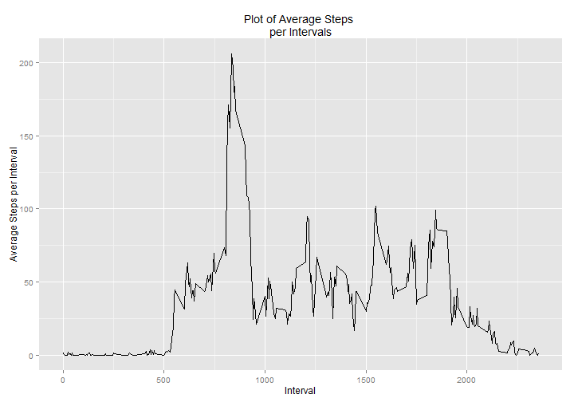
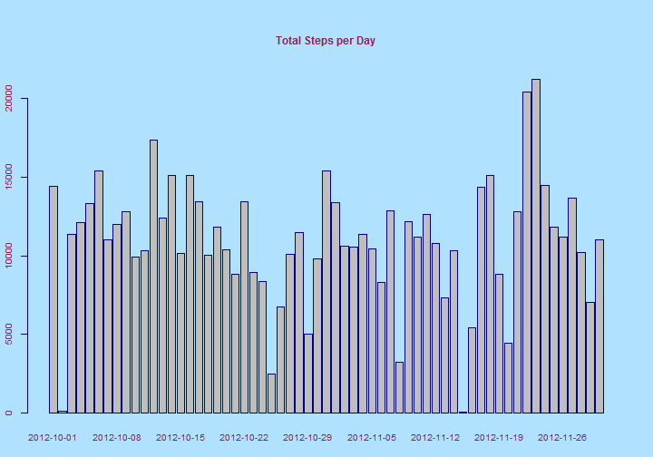
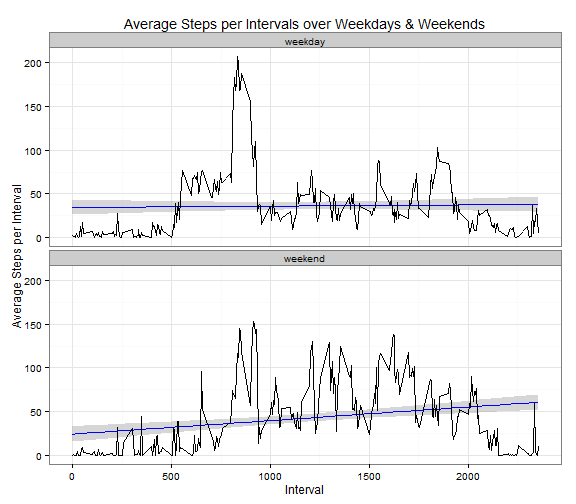

# Reproducible Research: Peer Assessment 1

## Introduction

It is now possible to collect a large amount of data about personal
movement using activity monitoring devices such as a
[Fitbit](http://www.fitbit.com), [Nike
Fuelband](http://www.nike.com/us/en_us/c/nikeplus-fuelband), or
[Jawbone Up](https://jawbone.com/up). These type of devices are part of
the "quantified self" movement -- a group of enthusiasts who take
measurements about themselves regularly to improve their health, to
find patterns in their behavior, or because they are tech geeks. But
these data remain under-utilized both because the raw data are hard to
obtain and there is a lack of statistical methods and software for
processing and interpreting the data.

This assignment makes use of data from a personal activity monitoring
device. This device collects data at 5 minute intervals through out the
day. The data consists of two months of data from an anonymous
individual collected during the months of October and November, 2012
and include the number of steps taken in 5 minute intervals each day.

## Data

The data for this assignment can be downloaded from the course web site:

Dataset: Activity monitoring data [52K]
The variables included in this dataset are:

  **steps**: Number of steps taking in a 5-minute interval (missing values are coded as NA)

  **date**: The date on which the measurement was taken in YYYY-MM-DD format  

  **interval**: Identifier for the 5-minute interval in which measurement was taken

The dataset is stored in a comma-separated-value (CSV) file and there are a total of 17,568 observations in this dataset.


## Loading and preprocessing the data


```r
data <- read.csv("activity.csv")
str(data)
```

```
## 'data.frame':	17568 obs. of  3 variables:
##  $ steps   : int  NA NA NA NA NA NA NA NA NA NA ...
##  $ date    : Factor w/ 61 levels "2012-10-01","2012-10-02",..: 1 1 1 1 1 1 1 1 1 1 ...
##  $ interval: int  0 5 10 15 20 25 30 35 40 45 ...
```
There was no transformation of the data needed. The data is stored in a dataframe called 'data'. The dataframe consist of 17,568 observations of 3 variables: 'steps', 'date', 'interval'.

## What is mean total number of steps taken per day?

The mean number of steps is derived by creating a dataframe called 'steps.per.day'.


```r
library (plyr)
steps.per.day<-ddply(data, .(date), summarize,total=sum(steps,na.rm=TRUE))
str(steps.per.day)
```

```
## 'data.frame':	61 obs. of  2 variables:
##  $ date : Factor w/ 61 levels "2012-10-01","2012-10-02",..: 1 2 3 4 5 6 7 8 9 10 ...
##  $ total: int  0 126 11352 12116 13294 15420 11015 0 12811 9900 ...
```

'steps.per.day' is a dataframe of 61 observations in 2 variables: 'date' and 'total'.

The total number of steps per day can be graphically shown in the following manner:


```r
library(ggplot2)

cl <- colors() #colors is a vector containing the color palete
par(ps=10, mar=c(3.1,2.1,6.1,2.1), fg="blue4",col.lab="violetred4", col.main="violetred4", col.axis="violetred4", bg=cl[431])
barplot(steps.per.day$total,main="Total Steps per Day", xlab="Day", ylab="Total Steps", names.arg=steps.per.day$date)
```

 

The mean and median of the daily number of steps can be computed in the following manner:


```r
daily.mean <- mean(steps.per.day$total)
daily.median <- median(steps.per.day$total)
options(scipen=9, digits=2) 
```

The daily mean steps is 9354.23. 
The daily median steps is 10395.

## What is the average daily activity pattern?

The average computed across each 3-minute interval and across all days can be computed by subsetting a new dataframe using 'data$interval' and summarized by mean.


```r
avg.steps.per.interval<- ddply (data, .(interval), summarize, avg.steps=mean(steps, na.rm=TRUE))
str(avg.steps.per.interval)
```

```
## 'data.frame':	288 obs. of  2 variables:
##  $ interval : int  0 5 10 15 20 25 30 35 40 45 ...
##  $ avg.steps: num  1.717 0.3396 0.1321 0.1509 0.0755 ...
```

The resulting dataframe has 288 observations in 2 variables: 'interval' and 'avg.steps'.

The time series plot of the Average number of steps per day over all the 5-min intervals can be done in the following manner.


```r
g<-ggplot (avg.steps.per.interval, aes(x=interval, y=avg.steps)) + geom_line() +labs(x="Interval", y="Average Steps per Interval", title="Plot of Average Steps per Intervals" )
print (g)
```

 

To find the Interval where the maximum number of steps occur, we can do the following.


```r
result <- avg.steps.per.interval$interval[which.max(avg.steps.per.interval$avg.steps)]
```
The maximum number of steps occurs at interval 835. 
The corresponding maximum number of steps can be found from the following.


```r
max.steps <- avg.steps.per.interval$avg.steps[which.max(avg.steps.per.interval$avg.steps)]
```

The maximum number of steps is 206.17.

## Imputing missing values

Some values in 'steps' in the 'data' dataframe are missing (NAs). To get the number of missing observations, we can do the following.


```r
missing <- sum(is.na(data$steps))
```

The number of missing observations is 2304.

To fill in the NA entries, we can use the MICE (Multivariate Imputation by Chained Equations) package.


```r
library ("mice")
imputed.data <- mice(data)
```

```
## 
##  iter imp variable
##   1   1  steps
##   1   2  steps
##   1   3  steps
##   1   4  steps
##   1   5  steps
##   2   1  steps
##   2   2  steps
##   2   3  steps
##   2   4  steps
##   2   5  steps
##   3   1  steps
##   3   2  steps
##   3   3  steps
##   3   4  steps
##   3   5  steps
##   4   1  steps
##   4   2  steps
##   4   3  steps
##   4   4  steps
##   4   5  steps
##   5   1  steps
##   5   2  steps
##   5   3  steps
##   5   4  steps
##   5   5  steps
```

```r
imputed.data.final <- complete(imputed.data)
```
Next we extract a dataframe to hold the total of steps per day.


```r
imputed.data.final$date <- as.Date(imputed.data.final$date, "%Y-%m-%d")
imputed.steps.per.day <- ddply (imputed.data.final, .(date), summarize, total.steps=sum(steps))
str(imputed.steps.per.day)
```

```
## 'data.frame':	61 obs. of  2 variables:
##  $ date       : Date, format: "2012-10-01" "2012-10-02" ...
##  $ total.steps: int  14505 126 11352 12116 13294 15420 11015 13007 12811 9900 ...
```

We can then create a barplot of the data.


```r
cl <- colors() #colors is a vector containing the color palete
par(ps=10, mar=c(3.1,2.1,6.1,2.1), fg="blue4",col.lab="violetred4", col.main="violetred4", col.axis="violetred4", bg=cl[431])
g<-barplot(imputed.steps.per.day$total,main="Total Steps per Day", xlab="Day", ylab="Total Steps", names.arg=imputed.steps.per.day$date)
```

 

```r
print(g)
```

```
##       [,1]
##  [1,]  0.7
##  [2,]  1.9
##  [3,]  3.1
##  [4,]  4.3
##  [5,]  5.5
##  [6,]  6.7
##  [7,]  7.9
##  [8,]  9.1
##  [9,] 10.3
## [10,] 11.5
## [11,] 12.7
## [12,] 13.9
## [13,] 15.1
## [14,] 16.3
## [15,] 17.5
## [16,] 18.7
## [17,] 19.9
## [18,] 21.1
## [19,] 22.3
## [20,] 23.5
## [21,] 24.7
## [22,] 25.9
## [23,] 27.1
## [24,] 28.3
## [25,] 29.5
## [26,] 30.7
## [27,] 31.9
## [28,] 33.1
## [29,] 34.3
## [30,] 35.5
## [31,] 36.7
## [32,] 37.9
## [33,] 39.1
## [34,] 40.3
## [35,] 41.5
## [36,] 42.7
## [37,] 43.9
## [38,] 45.1
## [39,] 46.3
## [40,] 47.5
## [41,] 48.7
## [42,] 49.9
## [43,] 51.1
## [44,] 52.3
## [45,] 53.5
## [46,] 54.7
## [47,] 55.9
## [48,] 57.1
## [49,] 58.3
## [50,] 59.5
## [51,] 60.7
## [52,] 61.9
## [53,] 63.1
## [54,] 64.3
## [55,] 65.5
## [56,] 66.7
## [57,] 67.9
## [58,] 69.1
## [59,] 70.3
## [60,] 71.5
## [61,] 72.7
```

The daily mean and median of the imputed data can be computed as follows:


```r
imputed.daily.mean <- mean(imputed.steps.per.day$total)
imputed.daily.median <- median(imputed.steps.per.day$total)
```

The imputed daily mean steps is 10932.87 compared to the original mean steps of 9354.23. 
The daily median steps is 11162 compared to the original median steps of 10395. .

Thus we can see that both the imputed mean and median are higher than before the data was imputed. This is to be expected since we are extrapolating and filling in the empty spaces with simulated, likely some are non-zero, data.


## Are there differences in activity patterns between weekdays and weekends?

The data can be divided between 'weekdays' and 'weekends' in the following manner. The 'weekdays()' function is used to check if a date is a weekday or weekend.


```r
imputed.data.final$day.type <- ifelse (weekdays(as.Date(imputed.data.final$date)) %in% c("Saturday", "Sunday"),"weekend", "weekday")
imputed.data.final$day.type <- as.factor (imputed.data.final$day.type)

imputed.steps.per.interval <- ddply(imputed.data.final, .(interval, day.type), summarize, avg.steps=mean(steps))
str(imputed.steps.per.interval)
```

```
## 'data.frame':	576 obs. of  3 variables:
##  $ interval : int  0 0 5 5 10 10 15 15 20 20 ...
##  $ day.type : Factor w/ 2 levels "weekday","weekend": 1 2 1 2 1 2 1 2 1 2 ...
##  $ avg.steps: num  30.67 0 1.47 3 31.29 ...
```

The above creates a dataframe from the imputed data and consist of 3 observations: 'interval', day.type' and 'avg.steps'.

A panel plot of the data can be obtained through the following.


```r
g<-ggplot (imputed.steps.per.interval, aes(x=interval, y=avg.steps)) + geom_line() +theme_bw() +facet_wrap(~day.type, ncol=1) +labs(x="Interval", y="Average Steps per Interval", title="Average Steps per Intervals over Weekdays & Weekends" )
print(g)
```

 

From the graphs above, there is no significant difference in pattern between the average steps over intervals between weekdays and weekends. 


